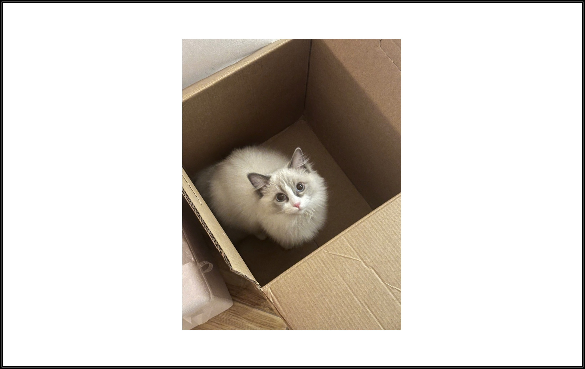
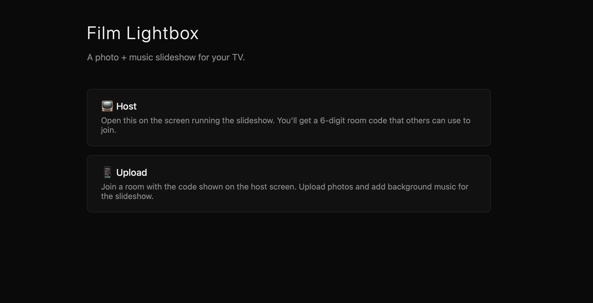
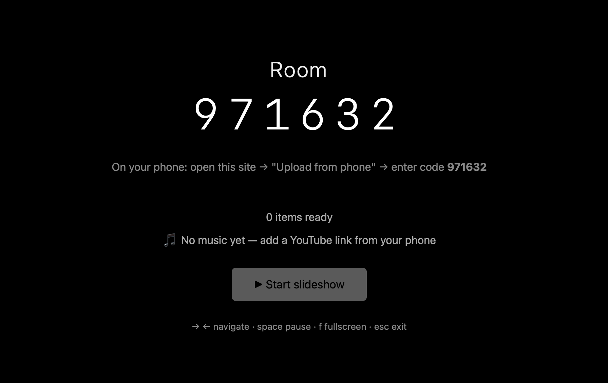
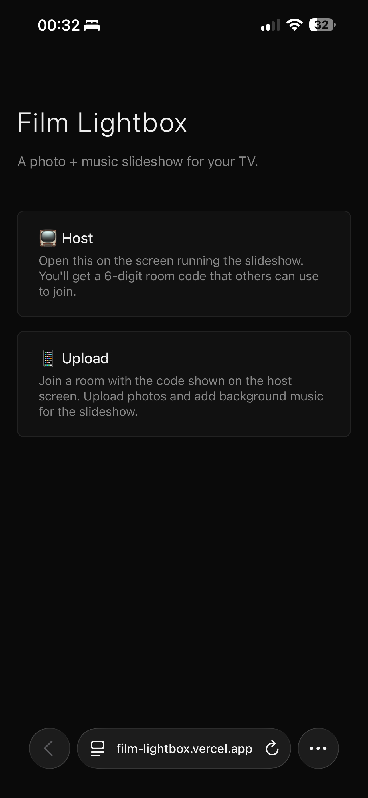
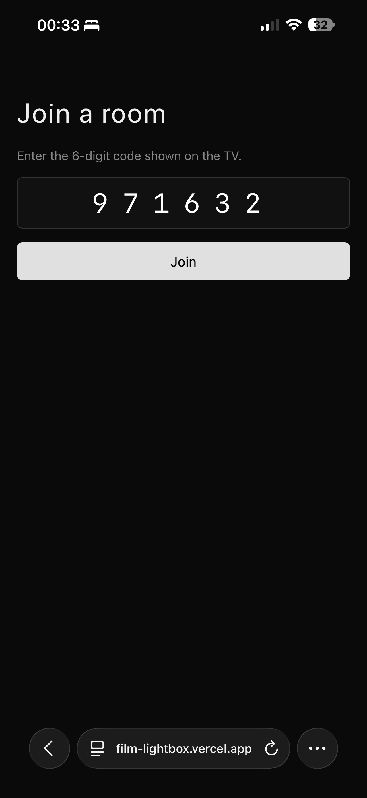
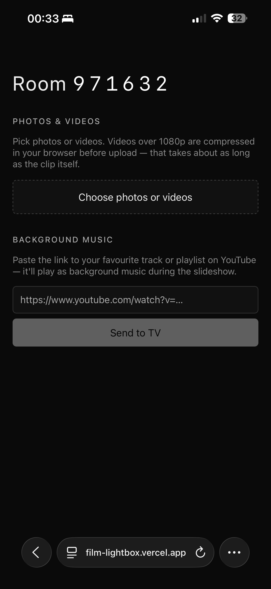
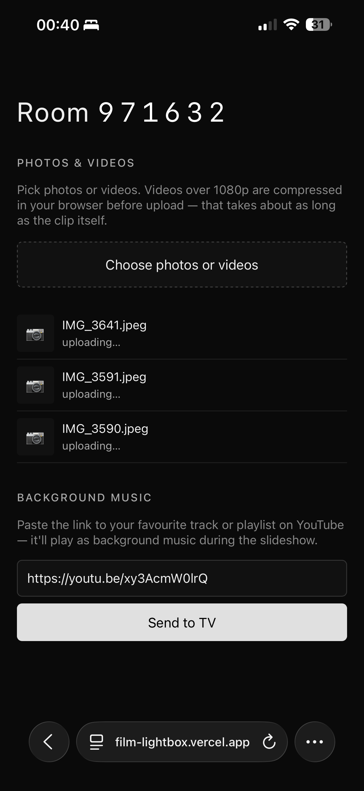
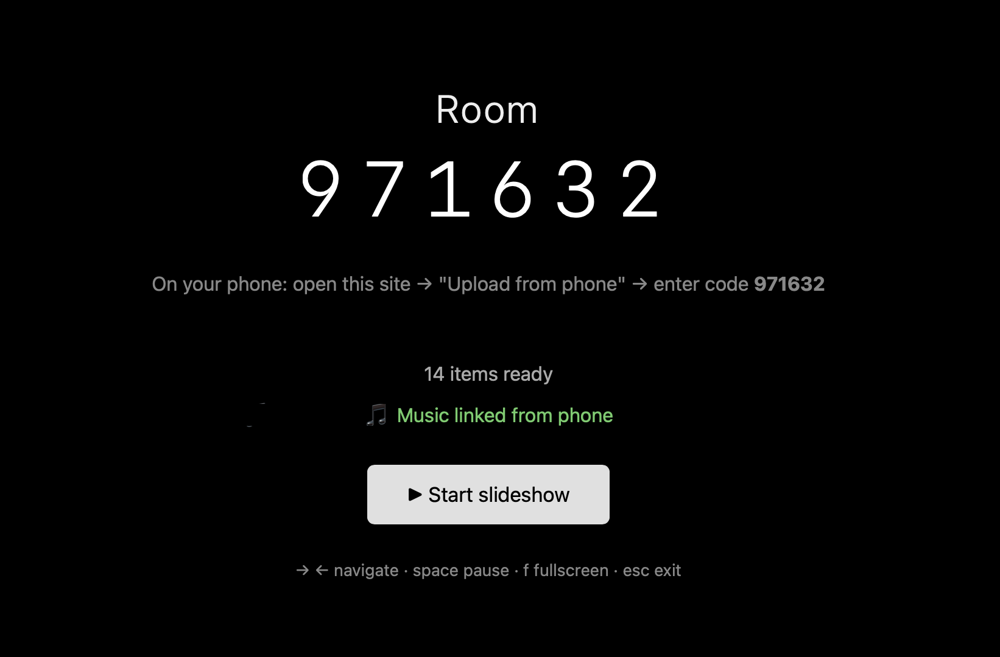

# Film Lightbox
You can't always bring your friends and family with you, whether it's a trip or a night out. But with Film Lightbox you can always make them feel like they were part of the experience. 

Film Lightbox is a shared photo slideshow for a gathering. One device acts as a display; everyone else joins by entering a 6-digit code on their phone and uploading photos directly from their camera roll. Guests can also drop a YouTube link to set the background music. No accounts, no app install. Built with SvelteKit, Supabase Storage, and deployed on Vercel.


**Live at [film-lightbox.vercel.app](https://film-lightbox.vercel.app/)**



The original idea was to build this as a way to revisit film photos after trips. Hence the name "Film Lightbox".

---

## When to reach for it

- **Any gathering** — birthdays, family reunions, year-in-review nights. Share the code, everyone contributes from their camera roll, and the photos loop on the big screen in the background.
- **Guess whose photo** — everyone drops one photo from their life anonymously; the room tries to guess the owner of each photo to its owner.
- **Event photo walls** — conference hallways, office parties, school events. Guests see themselves on screen within seconds of uploading.

---


## Walkthrough

**Step 1 — Open the site on your host device and click Host**



*The landing page. Pick **Host** on the device that will run the display.*

---

**Step 2 — A 6-digit room code appears. Share it with your guests**



---

**Step 3 — Guests open the same URL on their phones and enter the code**

<table width="100%"><tr>
<td width="50%"></td>
<td width="50%"></td>
</tr></table>

*Tap **Upload** on the phone, type the 6-digit code from the screen, and you're in. Anyone with the code can join; the whole room contributes to the same session at the same time.*

---

**Step 4 — Select photos and send them to the screen**

<table width="100%"><tr>
<td width="50%"></td>
<td width="50%"></td>
</tr></table>

*Pick photos from your camera roll. You can also paste a YouTube link to set the background music which will be played during the slideshow.*

---

**Step 5 — Photos appear on the host screen within seconds**



**Step 6 — Press Start Slideshow**
The slideshow is now running.
---

## Modes

| Mode | URL | What it does |
|------|-----|--------------|
| **Host** | `/host` | Opens on the host device. Generates a 6-digit room code, polls for incoming uploads every 3 seconds, and runs the slideshow in fullscreen with smooth crossfade transitions. |
| **Upload** | `/upload` | Guest view. Enter the room code, pick photos and short videos (both transcoded client-side before upload), and optionally paste a YouTube link to set the background music — the host picks it up automatically. |

---

## How it works

### Host / guest handshake

```
┌─────────────┐                ┌────────────────────────────┐                ┌─────────────┐
│   Phone     │   upload  ────▶│      Supabase Storage      │◀── list (3s) ──│    Host     │
│  /upload    │                │ rooms/room_<code>/         │                │   /host     │
└─────────────┘                │  ├── <ts>_<rand>.jpg/webm  │                └─────────────┘
                               │  ├── youtube.txt   (music) │
                               │  ├── order.txt     (queue) │
                               │  └── host_word.txt (recovery)
                               └────────────────────────────┘
                                          │
                                          │  daily Vercel Cron
                                          ▼
                                    /api/cleanup
                                    (deletes rooms oler than 24 hours)
```

The whole app is a single Supabase Storage bucket. There is no database, no realtime channel, no auth — every piece of room state is a file in `room_<code>/`, and the host just lists that folder on a 3-second timer.

- **Room codes** are 6-digit numbers generated in the browser. The code *is* the access token. Right for short-lived gatherings; not for sensitive media (see [Limitations](#limitations)).
- **Photos & videos** are downscaled in the browser before upload — photos to 1920×1080 JPEG (~200 KB), videos re-encoded to a smaller WebM/MP4 — and stored as `<timestamp>_<rand>.<ext>`. The host's poll pulls in any new files it hasn't seen yet.
- **Order** is tracked in `order.txt`. The phone rewrites it whenever a guest reorders or deletes an item, and the host respects that ordering on its next poll. New uploads not yet in the file fall to the end.
- **Music** lives in `youtube.txt`. The phone upserts the URL; the same poll that picks up new photos notices the file's `updated_at` change, refetches it, and remounts the YouTube iframe so the track swaps mid-slideshow.
- **Session recovery** — each host session generates a safe word (e.g. `cedar`, `dusk`, `ember`) and writes it to `host_word.txt`. If the browser tab closes, the host can reopen the room by entering the 6-digit code and the word; uploaded photos are still in the bucket.
- **Cleanup** runs daily via Vercel Cron — `GET /api/cleanup` walks the bucket and deletes rooms older than 24 hours.
### The player
---

## Project structure

```
src/
├── lib/
│   ├── supabase.ts        Browser Supabase client (anon key)
│   ├── server/supabase.ts Server Supabase client (service role, used only by /api/cleanup)
│   ├── roomCode.ts        6-digit code generation + validation
│   ├── roomWord.ts        Safe-word list for host session recovery
│   ├── resizeImage.ts     In-browser photo resize to 1920×1080 JPEG
│   ├── processVideo.ts    In-browser video re-encode (WebM/MP4)
│   └── youtube.ts         URL → video ID parsing, embed URL builder
└── routes/
    ├── +page.svelte       Landing page (mode picker)
    ├── host/              Host view: room code, polling, fullscreen player
    ├── upload/            Phone view: photo/video + music input
    └── api/cleanup/       Daily TTL sweep (POST manual / GET cron)
```

---

## Running locally

Requires Node 20+ and `pnpm`.

```sh
pnpm install
pnpm dev
# open http://localhost:5173
```

Copy `.env.example` → `.env` and fill in your Supabase credentials before running.


---

## Deployment (Vercel)

The repo ships with `@sveltejs/adapter-vercel` and a `vercel.json` that schedules the cleanup cron.

1. **Supabase** — create a project, add a public Storage bucket named `rooms`, and enable `INSERT` + `SELECT` policies for the `anon` role.
2. **Vercel** — import the GitHub repo. SvelteKit is auto-detected.
3. **Environment variables** (Production + Preview):

   | Name | Scope | Notes |
   |------|-------|-------|
   | `PUBLIC_SUPABASE_URL` | Public, build-time | Inlined into the client bundle. |
   | `PUBLIC_SUPABASE_ANON_KEY` | Public, build-time | Inlined into the client bundle. |
   | `PUBLIC_SUPABASE_BUCKET` | Public, build-time | Default `rooms`. |
   | `SUPABASE_SERVICE_ROLE_KEY` | Server-only | Used by `/api/cleanup`. |

4. Deploy. Vercel provisions the cron automatically from `vercel.json`.

---

## Tech stack

| Layer | Choice | Why |
|-------|--------|-----|
| Framework | **SvelteKit 2** + **Svelte 5** | Tiny bundle, file-based routing, and `$state` / `$derived` make the slideshow timing logic readable. |
| Language | **TypeScript** | Strong types across DB schemas and Supabase responses. |
| Storage | **Supabase Storage** | One public bucket per environment; rooms are folders (`room_<code>/`). No relational data needed, so Postgres is skipped entirely. |
| Media pipeline | **Browser-native canvas + `MediaRecorder`** | Photos resized to 1920×1080 JPEG (~200 KB); videos re-encoded to WebM (or MP4 fallback) before upload. Saves bandwidth on hotel Wi-Fi and keeps host playback consistent. |
| Hosting | **Vercel** (`@sveltejs/adapter-vercel`) | Static client + serverless `/api/*` routes + Vercel Cron for cleanup. |
| Background music | **YouTube IFrame embed** | No licensing headaches, no audio files to host. Guest sends a URL, host embeds it. |

---

## Design decisions

- **No realtime, no WebSockets.** A 3-second poll is good enough for a slideshow that updates every minute or two. Fewer dependencies, simpler deployment, trivial to reason about.
- **No database.** Folders in Supabase Storage *are* the data model. Listing a folder gives an ordered file list with `created_at`; that's the entire host-mode read path.
- **Public bucket + short TTL** instead of signed URLs. Tradeoff: anyone with the code can read/write, but the room evaporates in 24 hours. Should not be used for sensitive media, but fine for parties and gatherings.
- **Client-side resize.** Capping uploads at 1920×1080 JPEG gets photos under 250 KB on average, and videos are similarly re-encoded before upload.

---

## Limitations

- The 6-digit code is the only access control. Fine for parties, not for sensitive media.
- Background music is YouTube-only — paste a track or playlist URL and it embeds via the YouTube iframe API. No audio file uploads.
---

## License

MIT.
